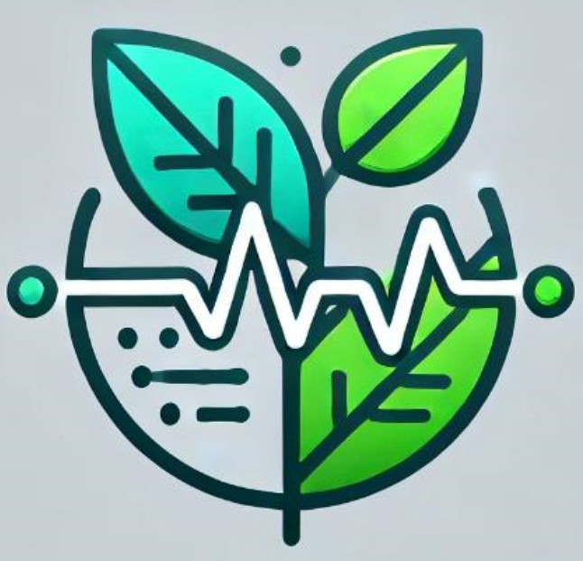

# PlantPulse Frontend - Complete Issues Analysis & Solutions

## Overview
Your frontend (Vercel) is trying to communicate with backend (Render), but there are architectural and configuration issues preventing successful communication.

---

## Issues Found & Fixed

### **Issue 1: CORS (Cross-Origin Resource Sharing) Error** ❌
**Problem**: Your frontend on `plantpulseaigok-glio0dlr-hansavahinis-projects.vercel.app` cannot communicate with backend on `plantpulseai.onrender.com` due to missing CORS headers.

**Error**: "Failed to fetch"

**Root Cause**: 
- Browsers block requests from one domain to another unless the backend explicitly allows it
- Your Render backend is not sending `Access-Control-Allow-Origin` headers

**Solution Required on Backend**:
Add CORS support to your Flask/Python backend:

```python
from flask_cors import CORS

app = Flask(__name__)
CORS(app)  # Enable for all routes
```

OR manually add headers:
```python
@app.after_request
def add_cors_headers(response):
    response.headers['Access-Control-Allow-Origin'] = '*'
    response.headers['Access-Control-Allow-Methods'] = 'GET, POST, OPTIONS'
    response.headers['Access-Control-Allow-Headers'] = 'Content-Type'
    return response
```

---

### **Issue 2: Incorrect Redirect Strategy** ❌
**Problem** (Line 224 in index.html):
```javascript
window.location.href = `${BACKEND_URL}/result`;  // WRONG
```

**Why It's Wrong**:
- You're trying to redirect to the backend's domain
- But result.html is hosted on the frontend (Vercel)
- The backend doesn't have a `/result` endpoint that renders HTML

**Solution Applied** ✅:
```javascript
window.location.href = "result.html";  // Redirect to local frontend page
```

---

### **Issue 3: Misaligned Frontend-Backend Architecture** ❌
**Problem**: 
- result.html has Jinja2 template syntax (``, `{{ }}`)
- But it's hosted on Vercel (static host), not on Python backend
- Jinja2 templates need to be rendered by a Python server

**Original Design Assumption**:
- Frontend: Upload image
- Backend: Returns JSON + renders result page with Jinja2

**Corrected Design** ✅:
- Frontend: Upload image → receives JSON → stores in localStorage
- Frontend: Displays result using JavaScript from localStorage
- result.html: Pure HTML + JavaScript (no Jinja2 needed)

---

### **Issue 4: Static Asset Paths** ❌
**Problem** (Line 153 in result.html):
```html

```

**Why It's Wrong**:
- Absolute paths (`/static/`) don't work on Vercel
- Path resolves to `vercel.app/static/logo.png` which doesn't exist

**Solution Applied** ✅:
```html

```

Also fixed footer link:
```html
<!-- Before -->
<a href="/">Back to Home</a>

<!-- After -->
<a href="index.html">Back to Home</a>
```

---

## Current Architecture (Fixed)

```
User Browser
    ↓
Frontend (Vercel) - index.html
    ↓ (Fetch to Backend API)
    ↓ CORS headers must be present
Backend (Render) - /predict endpoint
    ↓ (Returns JSON)
Frontend (Vercel) - result.html
    ↓ (Reads from localStorage)
Display Results (JavaScript rendering)
```

---

## What You Need to Do NOW

### **On Backend (Render)**:
1. Add CORS support to your Flask app
2. Ensure `/predict` endpoint returns JSON with:
   - `status`: "success"
   - `predicted_class`: disease name
   - `confidence`: float (0-1)
   - `image_url`: URL of uploaded image
   - `solutions`: object with Symptoms, reason, Effects, Treatment, Products, Precautions

### **On Frontend (Already Fixed)**:
✅ index.html now redirects to local result.html instead of backend
✅ result.html now uses JavaScript to render from localStorage
✅ Static paths fixed to relative paths
✅ Enhanced error logging added

---

## How to Test

1. **Open browser DevTools** (F12)
2. **Go to Console tab**
3. **Upload an image**
4. **Look for console logs**:
   - "Sending request to: https://plantpulseai.onrender.com/predict"
   - "Response status: 200" (or error status)
   - "Response data: {...}" (shows what backend returned)

5. **If you see CORS error**:
   - You need to add CORS headers to backend
   - Check your backend logs on Render

---

## Files Modified

- ✅ `c:\Frontend\templates\index.html` - Fixed redirect & enhanced logging
- ✅ `c:\Frontend\templates\result.html` - Fixed asset paths

## Next Steps

1. **Update your backend** to add CORS headers
2. **Test the upload flow** with DevTools console open
3. **Share backend code** if you need help adding CORS

---

## Backend CORS Fix (Quick Reference)

**For Flask**:
```python
from flask import Flask
from flask_cors import CORS

app = Flask(__name__)
CORS(app, resources={r"/predict": {"origins": "*"}})

@app.route('/predict', methods=['POST'])
def predict():
    # Your prediction logic
    return jsonify({
        'status': 'success',
        'predicted_class': 'disease_name',
        'confidence': 0.95,
        'image_url': '/path/to/image.jpg',
        'solutions': {...}
    })
```

**For FastAPI**:
```python
from fastapi.middleware.cors import CORSMiddleware

app.add_middleware(
    CORSMiddleware,
    allow_origins=["*"],
    allow_methods=["*"],
    allow_headers=["*"],
)
```

---

## Summary

| Issue | Status | Solution |
|-------|--------|----------|
| CORS Error | 🔴 Needs Backend | Add CORS headers to backend |
| Wrong Redirect | ✅ Fixed | Now redirects to local result.html |
| Architecture Mismatch | ✅ Fixed | Using JavaScript rendering instead of Jinja2 |
| Static Paths | ✅ Fixed | Changed to relative paths |
| Error Logging | ✅ Enhanced | Console logs for debugging |

The frontend is now ready. You just need to **enable CORS on your backend**.
